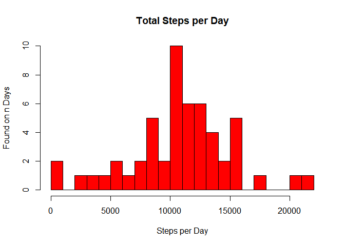
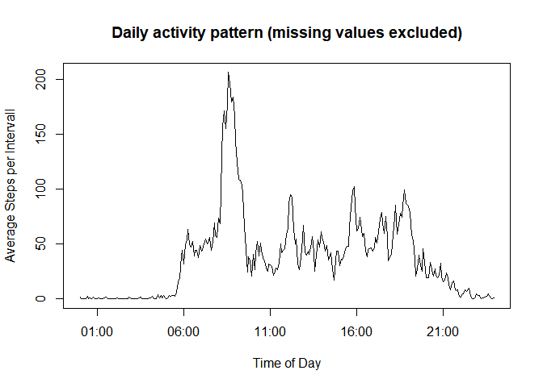
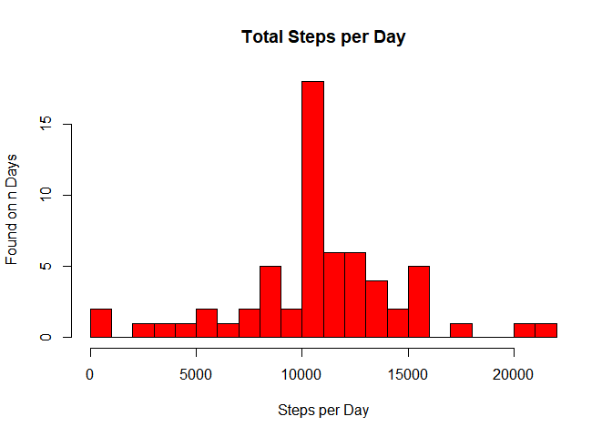
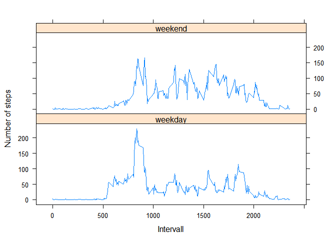

# Reproducible Research: Peer Assessment 1

```r
knitr::opts_chunk$set(warning = FALSE, message = FALSE)
```

## Loading and preprocessing the data

First set the necessary libraries and load a function to output summary in a formatted form
.

```r
library(data.table)
library(stringr)
library(plyr)
library(dplyr)
library(lattice)

source("SummaryOut.R")
```

The data are available as zip file. This file contains one csv file named activity.csv. It is already unpacked into the subfolder "figure" under the folder the script resides in.

The data file is a standard csv file with the following properties:

* the first row contains the column names
* column separator is ,
* String delimiter is "
* missing values are marked as NA


```r
f <- ".\\figure\\activity.csv"
rawData <- fread(f, sep = ",")
rawData$date <- as.Date(rawData$date)
summary.out(rawData)
```


<table class="table table-condensed">
 <thead>
  <tr>
   <th style="text-align:right;"> Variable </th>
   <th style="text-align:right;"> 1st Qu. </th>
   <th style="text-align:right;"> 3rd Qu. </th>
   <th style="text-align:right;"> Max.    </th>
   <th style="text-align:right;"> Mean    </th>
   <th style="text-align:right;"> Median  </th>
   <th style="text-align:right;"> Min.    </th>
   <th style="text-align:right;"> NA's    </th>
  </tr>
 </thead>
<tbody>
  <tr>
   <td style="text-align:right;"> steps </td>
   <td style="text-align:right;"> 0.0 </td>
   <td style="text-align:right;"> 12.0 </td>
   <td style="text-align:right;"> 806 </td>
   <td style="text-align:right;"> 37.38 </td>
   <td style="text-align:right;"> 0.0 </td>
   <td style="text-align:right;"> 0 </td>
   <td style="text-align:right;"> 2304 </td>
  </tr>
  <tr>
   <td style="text-align:right;"> interval </td>
   <td style="text-align:right;"> 588.8 </td>
   <td style="text-align:right;"> 1766.2 </td>
   <td style="text-align:right;"> 2355 </td>
   <td style="text-align:right;"> 1177.50 </td>
   <td style="text-align:right;"> 1177.5 </td>
   <td style="text-align:right;"> 0 </td>
   <td style="text-align:right;"> NA </td>
  </tr>
</tbody>
</table>

## What is mean total number of steps taken per day?

To answer this questions the raw data are summed up on date level. 


```r
perDay <- rawData %>% select(date, steps) %>% 
                      filter(!is.na(steps)) %>% 
                      ddply(.(date), summarise, total.steps.per.day = sum(steps))
summary.out(perDay)
```


<table class="table table-condensed">
 <thead>
  <tr>
   <th style="text-align:right;"> Variable </th>
   <th style="text-align:right;"> 1st Qu. </th>
   <th style="text-align:right;"> 3rd Qu. </th>
   <th style="text-align:right;"> Max.    </th>
   <th style="text-align:right;"> Mean    </th>
   <th style="text-align:right;"> Median  </th>
   <th style="text-align:right;"> Min.    </th>
  </tr>
 </thead>
<tbody>
  <tr>
   <td style="text-align:right;"> total.steps.per.day </td>
   <td style="text-align:right;"> 8841 </td>
   <td style="text-align:right;"> 13294 </td>
   <td style="text-align:right;"> 21194 </td>
   <td style="text-align:right;"> 10766 </td>
   <td style="text-align:right;"> 10765 </td>
   <td style="text-align:right;"> 41 </td>
  </tr>
</tbody>
</table>

The aggregated data are presented as histogram.


```r
hist(perDay$total.steps.per.day[!is.na(perDay$total.steps.per.day)], 
      breaks = 20,
      main = "Total Steps per Day",
      xlab = "Steps per Day",
      ylab = "Found on n Days",
      col = "red") 
```

<!-- -->


```r
mean.total.steps <- mean(perDay$total.steps.per.day)
print(paste("Mean of total steps:", as.character(round(mean.total.steps, digits = 4))))
```

```
## [1] "Mean of total steps: 10766.1887"
```

```r
median.total.steps <- median(perDay$total.steps.per.day)
print(paste("Median of total steps:", round(median.total.steps, digits = 4)))
```

```
## [1] "Median of total steps: 10765"
```

## What is the average daily activity pattern?

To answer this question, the raw data are aggregated on interval level. The average is calculated. Rows containing NA values in step column are removed.


```r
avg.daily.act.pat <- rawData %>% select(interval, steps) %>% 
                      filter(!is.na(steps)) %>%
                      ddply(.(interval), summarize, average.steps.per.interval = mean(steps))
summary.out(avg.daily.act.pat)
```


<table class="table table-condensed">
 <thead>
  <tr>
   <th style="text-align:right;"> Variable </th>
   <th style="text-align:right;"> 1st Qu. </th>
   <th style="text-align:right;"> 3rd Qu. </th>
   <th style="text-align:right;"> Max.    </th>
   <th style="text-align:right;"> Mean    </th>
   <th style="text-align:right;"> Median  </th>
   <th style="text-align:right;"> Min.    </th>
  </tr>
 </thead>
<tbody>
  <tr>
   <td style="text-align:right;"> interval </td>
   <td style="text-align:right;"> 588.800 </td>
   <td style="text-align:right;"> 1766.200 </td>
   <td style="text-align:right;"> 2355.00 </td>
   <td style="text-align:right;"> 1177.500 </td>
   <td style="text-align:right;"> 1177.500 </td>
   <td style="text-align:right;"> 0 </td>
  </tr>
  <tr>
   <td style="text-align:right;"> average.steps.per.interval </td>
   <td style="text-align:right;"> 2.486 </td>
   <td style="text-align:right;"> 52.835 </td>
   <td style="text-align:right;"> 206.17 </td>
   <td style="text-align:right;"> 37.383 </td>
   <td style="text-align:right;"> 34.113 </td>
   <td style="text-align:right;"> 0 </td>
  </tr>
</tbody>
</table>

The intervall is taken in 5 minutes steps. When the full hour is reached, the hour is included and the minutes is set back to 0 (i.e. 50, 55, 100, 105 or 1250, 1255, 1300). Start value is 00. The last step of the day is 2355.

To increase readabillity the interval is converted to time format. To gain this, the value is interpreted as string and concatenated with preceeding 0000. Now the rightmost 4 characters of this string are taken and converted to posix date/time. The date part can be ignorred. 


```r
avg.daily.act.pat$interval_dat <- 
  strptime(str_sub(paste0("0000", avg.daily.act.pat$interval), -4, -1), "%H%M")
str(avg.daily.act.pat)
```

```
## 'data.frame':	288 obs. of  3 variables:
##  $ interval                  : int  0 5 10 15 20 25 30 35 40 45 ...
##  $ average.steps.per.interval: num  1.717 0.3396 0.1321 0.1509 0.0755 ...
##  $ interval_dat              : POSIXlt, format: "2017-04-24 00:00:00" "2017-04-24 00:05:00" ...
```

Now the the data are visualized as line graph.


```r
with(avg.daily.act.pat, 
      plot(interval_dat, average.steps.per.interval,
                type = "l",
                main = "Daily activity pattern (missing values excluded)",
                xlab = "Time of Day",
                ylab = "Average Steps per Intervall"))
```

<!-- -->

To find the time interval having the maximum number of steps, max is calculated and than the interval is selected from the data.


```r
  max.steps <- max(avg.daily.act.pat$average.steps.per.interval)
  paste("The maximum number of average steps/interval is", round(max.steps, digits = 0), 
        "it occured at", format(avg.daily.act.pat$interval_dat[avg.daily.act.pat$average.steps.per.interval == max.steps], "%H:%M"))
```

```
## [1] "The maximum number of average steps/interval is 206 it occured at 08:35"
```


## Imputing missing values

To fill the missing values the average value of the corresponding intervall is used.The average is already calculated. Now these averages are bound to the raw data. Afterwards the missing steps are filled from the average steps and a new set with just date, interval and steps is derived from the data.


```r
t <- merge.data.frame(
        rawData, avg.daily.act.pat, 
                  by.x = "interval", 
                  by.y = "interval")

t$steps[is.na(t$steps)] <- t$average.steps.per.interval[is.na(t$steps)]
enhanced.set <- t %>% select(interval, steps, date)
summary.out(enhanced.set)
```


<table class="table table-condensed">
 <thead>
  <tr>
   <th style="text-align:right;"> Variable </th>
   <th style="text-align:right;"> 1st Qu. </th>
   <th style="text-align:right;"> 3rd Qu. </th>
   <th style="text-align:right;"> Max.    </th>
   <th style="text-align:right;"> Mean    </th>
   <th style="text-align:right;"> Median  </th>
   <th style="text-align:right;"> Min.    </th>
  </tr>
 </thead>
<tbody>
  <tr>
   <td style="text-align:right;"> interval </td>
   <td style="text-align:right;"> 588.8 </td>
   <td style="text-align:right;"> 1766.2 </td>
   <td style="text-align:right;"> 2355 </td>
   <td style="text-align:right;"> 1177.50 </td>
   <td style="text-align:right;"> 1177.5 </td>
   <td style="text-align:right;"> 0 </td>
  </tr>
  <tr>
   <td style="text-align:right;"> steps </td>
   <td style="text-align:right;"> 0.0 </td>
   <td style="text-align:right;"> 27.0 </td>
   <td style="text-align:right;"> 806 </td>
   <td style="text-align:right;"> 37.38 </td>
   <td style="text-align:right;"> 0.0 </td>
   <td style="text-align:right;"> 0 </td>
  </tr>
</tbody>
</table>

The cleaned up data are now summoned up by date.


```r
enhanced.perDay <- 
  enhanced.set %>% select(date, steps) %>% 
                   ddply(.(date), summarise, total.steps.per.day = sum(steps))
summary.out(enhanced.perDay)
```


<table class="table table-condensed">
 <thead>
  <tr>
   <th style="text-align:right;"> Variable </th>
   <th style="text-align:right;"> 1st Qu. </th>
   <th style="text-align:right;"> 3rd Qu. </th>
   <th style="text-align:right;"> Max.    </th>
   <th style="text-align:right;"> Mean    </th>
   <th style="text-align:right;"> Median  </th>
   <th style="text-align:right;"> Min.    </th>
  </tr>
 </thead>
<tbody>
  <tr>
   <td style="text-align:right;"> total.steps.per.day </td>
   <td style="text-align:right;"> 9819 </td>
   <td style="text-align:right;"> 12811 </td>
   <td style="text-align:right;"> 21194 </td>
   <td style="text-align:right;"> 10766 </td>
   <td style="text-align:right;"> 10766 </td>
   <td style="text-align:right;"> 41 </td>
  </tr>
</tbody>
</table>

From these data a histogram is generated.


```r
hist(enhanced.perDay$total.steps.per.day[!is.na(enhanced.perDay$total.steps.per.day)], 
      breaks = 20,
      main = "Total Steps per Day",
      xlab = "Steps per Day",
      ylab = "Found on n Days",
      col = "red") 
```

<!-- -->


```r
enhanced.mean.total.steps <- mean(enhanced.perDay$total.steps.per.day)
print(paste("Mean of total steps:", as.character(round(enhanced.mean.total.steps, digits = 4))))
```

```
## [1] "Mean of total steps: 10766.1887"
```

```r
enhanced.median.total.steps <- median(enhanced.perDay$total.steps.per.day)
print(paste("Median of total steps:", round(enhanced.median.total.steps, digits = 4)))
```

```
## [1] "Median of total steps: 10766.1887"
```

## Are there differences in activity patterns between weekdays and weekends?

To the data set, that received average number of steps to fill missing values, a collumn is added to hold the weekday property. The type of the weekday is determined by the first character of the weekday name. The two weekend's days start wit with an "S" (Saturday and Sunday). The classification is converted to a factor value.


```r
t <- Sys.setlocale(category = "LC_ALL", locale = "English")
enhanced.set$weekday <- 
  factor(
    ifelse(substr(weekdays(enhanced.set$date), 1, 1) == "S", "weekend", "weekday"))
```

Next the data are grouped by weekday characteristic and interval. The average of steps for this grouping is calculated.


```r
weekday.set <- enhanced.set %>% 
               select(weekday, interval, steps) %>%
               ddply(.(weekday, interval), summarize, 
                    average.steps.per.interval = mean(steps))
summary.out(weekday.set)
```


<table class="table table-condensed">
 <thead>
  <tr>
   <th style="text-align:right;"> Variable </th>
   <th style="text-align:right;"> 1st Qu. </th>
   <th style="text-align:right;"> 3rd Qu. </th>
   <th style="text-align:right;"> Max.    </th>
   <th style="text-align:right;"> Mean    </th>
   <th style="text-align:right;"> Median  </th>
   <th style="text-align:right;"> Min.    </th>
   <th style="text-align:right;"> weekday </th>
   <th style="text-align:right;"> weekend </th>
  </tr>
 </thead>
<tbody>
  <tr>
   <td style="text-align:right;"> weekday </td>
   <td style="text-align:right;"> NA </td>
   <td style="text-align:right;"> NA </td>
   <td style="text-align:right;"> NA </td>
   <td style="text-align:right;"> NA </td>
   <td style="text-align:right;"> NA </td>
   <td style="text-align:right;"> NA </td>
   <td style="text-align:right;"> 288 </td>
   <td style="text-align:right;"> 288 </td>
  </tr>
  <tr>
   <td style="text-align:right;"> interval </td>
   <td style="text-align:right;"> 588.800 </td>
   <td style="text-align:right;"> 1766.200 </td>
   <td style="text-align:right;"> 2355.000 </td>
   <td style="text-align:right;"> 1177.500 </td>
   <td style="text-align:right;"> 1177.500 </td>
   <td style="text-align:right;"> 0 </td>
   <td style="text-align:right;"> NA </td>
   <td style="text-align:right;"> NA </td>
  </tr>
  <tr>
   <td style="text-align:right;"> average.steps.per.interval </td>
   <td style="text-align:right;"> 2.047 </td>
   <td style="text-align:right;"> 61.263 </td>
   <td style="text-align:right;"> 230.378 </td>
   <td style="text-align:right;"> 38.988 </td>
   <td style="text-align:right;"> 28.133 </td>
   <td style="text-align:right;"> 0 </td>
   <td style="text-align:right;"> NA </td>
   <td style="text-align:right;"> NA </td>
  </tr>
</tbody>
</table>

The data are sorted by weekday characteristic and interval. From the data two line graphs, one for weekends, one for weedays, are generated.


```r
weekday.set <- weekday.set %>% arrange(weekday, interval)

xyplot(average.steps.per.interval ~ interval | weekday, data = weekday.set, layout = c(1,2), type = "l", ylab = "Number of steps", xlab = "Intervall")
```

<!-- -->
