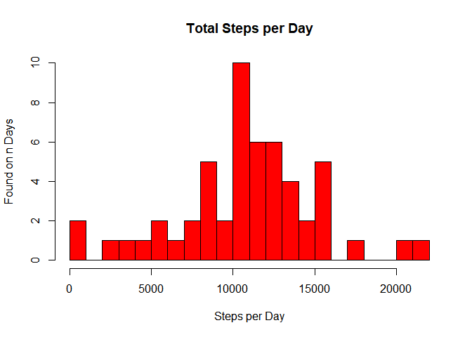
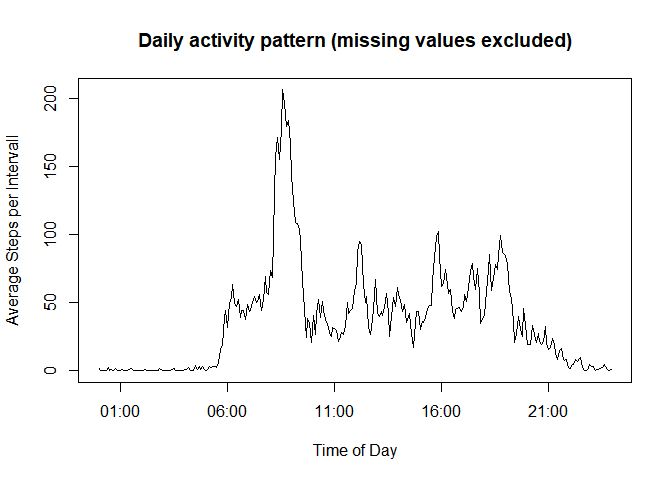
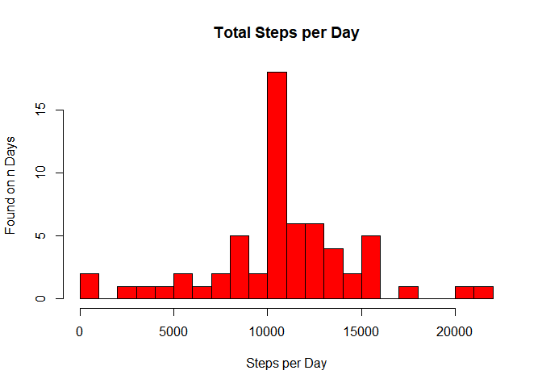

# Reproducible Research: Peer Assessment 1


## Loading and preprocessing the data

First set the necessary libraries and define a function.

```r
library(data.table)
library(stringr)
library(plyr)
library(dplyr)
library(formattable)

summary.out <- function(x) {
  t <- as.data.frame(summary(x))
  names(t) <- c("Empty", "Column", "Value")
  t[!is.na(t$Value),2:3]
}
```

The data are available as zip file. This file contains one csv file named activity.csv. It is unpacked into the subfolder .\figure.

The data file is a standard csv file with the following properties:

* the first row contains the column names
* column separator is ,
* String delimiter is "
* missing values are marked as NA


```r
f <- ".\\figure\\activity.csv"
rawData <- fread(f, sep = ",")
rawData$date <- as.Date(rawData$date)
summary.out(rawData)
```

```
##         Column                Value
## 1        steps     Min.   :  0.00  
## 2        steps     1st Qu.:  0.00  
## 3        steps     Median :  0.00  
## 4        steps     Mean   : 37.38  
## 5        steps     3rd Qu.: 12.00  
## 6        steps     Max.   :806.00  
## 7        steps       NA's   :2304  
## 8         date Min.   :2012-10-01  
## 9         date 1st Qu.:2012-10-16  
## 10        date Median :2012-10-31  
## 11        date Mean   :2012-10-31  
## 12        date 3rd Qu.:2012-11-15  
## 13        date Max.   :2012-11-30  
## 15    interval     Min.   :   0.0  
## 16    interval     1st Qu.: 588.8  
## 17    interval     Median :1177.5  
## 18    interval     Mean   :1177.5  
## 19    interval     3rd Qu.:1766.2  
## 20    interval     Max.   :2355.0
```

## What is mean total number of steps taken per day?

To answer this questions the raw data are aggregated on date level. 


```r
perDay <- rawData %>% select(date, steps) %>% 
                      filter(!is.na(steps)) %>% 
                      ddply(.(date), summarise, total.steps.per.day = sum(steps))
summary.out(perDay)
```

```
##                 Column                Value
## 1                 date Min.   :2012-10-02  
## 2                 date 1st Qu.:2012-10-16  
## 3                 date Median :2012-10-29  
## 4                 date Mean   :2012-10-30  
## 5                 date 3rd Qu.:2012-11-16  
## 6                 date Max.   :2012-11-29  
## 7  total.steps.per.day      Min.   :   41  
## 8  total.steps.per.day      1st Qu.: 8841  
## 9  total.steps.per.day      Median :10765  
## 10 total.steps.per.day      Mean   :10766  
## 11 total.steps.per.day      3rd Qu.:13294  
## 12 total.steps.per.day      Max.   :21194
```


```r
hist(perDay$total.steps.per.day[!is.na(perDay$total.steps.per.day)], 
      breaks = 20,
      main = "Total Steps per Day",
      xlab = "Steps per Day",
      ylab = "Found on n Days",
      col = "red") 
```

<!-- -->


```r
mean.total.steps <- mean(perDay$total.steps.per.day)
print(paste("Mean of total steps:", as.character(round(mean.total.steps, digits = 0))))
```

```
## [1] "Mean of total steps: 10766"
```

```r
median.total.steps <- median(perDay$total.steps.per.day)
print(paste("Median of total steps:", round(mean.total.steps, digits = 0)))
```

```
## [1] "Median of total steps: 10766"
```

## What is the average daily activity pattern?


```r
avg.daily.act.pat <- rawData %>% select(interval, steps) %>% 
                      filter(!is.na(steps)) %>%
                      ddply(.(interval), summarize, average.steps.per.interval = mean(steps))
summary.out(avg.daily.act.pat)
```

```
##                        Column             Value
## 1                    interval  Min.   :   0.0  
## 2                    interval  1st Qu.: 588.8  
## 3                    interval  Median :1177.5  
## 4                    interval  Mean   :1177.5  
## 5                    interval  3rd Qu.:1766.2  
## 6                    interval  Max.   :2355.0  
## 7  average.steps.per.interval Min.   :  0.000  
## 8  average.steps.per.interval 1st Qu.:  2.486  
## 9  average.steps.per.interval Median : 34.113  
## 10 average.steps.per.interval Mean   : 37.383  
## 11 average.steps.per.interval 3rd Qu.: 52.835  
## 12 average.steps.per.interval Max.   :206.170
```

The intervall is taken in 5 minutes steps. When then full hour is reached the hour is included and the minutes is set back to 0 (i.e. 50, 55, 100, 105 or 1250, 1255, 1300). Start value is 00. The last step of the day is 2355.

To increase radeballity the interval is converted to time format.


```r
avg.daily.act.pat$interval_dat <- 
  strptime(str_sub(paste0("0000", avg.daily.act.pat$interval), -4, -1), "%H%M")
head(avg.daily.act.pat)
```

```
##   interval average.steps.per.interval        interval_dat
## 1        0                  1.7169811 2017-04-23 00:00:00
## 2        5                  0.3396226 2017-04-23 00:05:00
## 3       10                  0.1320755 2017-04-23 00:10:00
## 4       15                  0.1509434 2017-04-23 00:15:00
## 5       20                  0.0754717 2017-04-23 00:20:00
## 6       25                  2.0943396 2017-04-23 00:25:00
```

Now the the data are visualized:


```r
with(avg.daily.act.pat, plot(interval_dat, average.steps.per.interval,
                             type = "l",
                             main = "Daily activity pattern (missing values excluded)",
                             xlab = "Time of Day",
                             ylab = "Average Steps per Intervall"))
```

<!-- -->

## Imputing missing values
To fill the missing values the average value of the corresponding intervall is used.

The average is already calculated. Now these avergaes are bound to the data.

```r
t <- merge.data.frame(rawData, avg.daily.act.pat, by.x = "interval", by.y = "interval")
t$steps[is.na(t$steps)] <- t$average.steps.per.interval[is.na(t$steps)]
enhanced.set <- t %>% select(interval, steps, date)
summary.out(enhanced.set)
```

```
##         Column                Value
## 1     interval     Min.   :   0.0  
## 2     interval     1st Qu.: 588.8  
## 3     interval     Median :1177.5  
## 4     interval     Mean   :1177.5  
## 5     interval     3rd Qu.:1766.2  
## 6     interval     Max.   :2355.0  
## 7        steps     Min.   :  0.00  
## 8        steps     1st Qu.:  0.00  
## 9        steps     Median :  0.00  
## 10       steps     Mean   : 37.38  
## 11       steps     3rd Qu.: 27.00  
## 12       steps     Max.   :806.00  
## 13        date Min.   :2012-10-01  
## 14        date 1st Qu.:2012-10-16  
## 15        date Median :2012-10-31  
## 16        date Mean   :2012-10-31  
## 17        date 3rd Qu.:2012-11-15  
## 18        date Max.   :2012-11-30
```

Now to step 1 corresponding data are build and presented


```r
enhanced.perDay <- enhanced.set %>% select(date, steps) %>% 
                                    ddply(.(date), summarise, total.steps.per.day = sum(steps))
summary.out(enhanced.perDay)
```

```
##                 Column                Value
## 1                 date Min.   :2012-10-01  
## 2                 date 1st Qu.:2012-10-16  
## 3                 date Median :2012-10-31  
## 4                 date Mean   :2012-10-31  
## 5                 date 3rd Qu.:2012-11-15  
## 6                 date Max.   :2012-11-30  
## 7  total.steps.per.day      Min.   :   41  
## 8  total.steps.per.day      1st Qu.: 9819  
## 9  total.steps.per.day      Median :10766  
## 10 total.steps.per.day      Mean   :10766  
## 11 total.steps.per.day      3rd Qu.:12811  
## 12 total.steps.per.day      Max.   :21194
```


```r
hist(enhanced.perDay$total.steps.per.day[!is.na(enhanced.perDay$total.steps.per.day)], 
      breaks = 20,
      main = "Total Steps per Day",
      xlab = "Steps per Day",
      ylab = "Found on n Days",
      col = "red") 
```

<!-- -->


```r
enhanced.mean.total.steps <- mean(enhanced.perDay$total.steps.per.day)
print(paste("Mean of total steps:", as.character(round(enhanced.mean.total.steps, digits = 0))))
```

```
## [1] "Mean of total steps: 10766"
```

```r
enhanced.median.total.steps <- median(enhanced.perDay$total.steps.per.day)
print(paste("Median of total steps:", round(enhanced.mean.total.steps, digits = 0)))
```

```
## [1] "Median of total steps: 10766"
```

## Are there differences in activity patterns between weekdays and weekends?

First to the enhanced data set a column to mark weekdays is added.

```r
t <- Sys.setlocale(category = "LC_ALL", locale = "English")
enhanced.set$weekday <- 
  factor(
    ifelse(substr(weekdays(enhanced.set$date), 1, 1) == "S", "weekend", "weekday"))
```
Now group the data by weekday / none-weekday and add again the column with the time value for the interval.

```r
weekday.set <- enhanced.set %>% select(weekday, interval, steps) %>%
                                ddply(.(weekday, interval), summarize, 
                                      average.steps.per.interval = mean(steps))
weekday.set$interval_dat <- 
  strptime(str_sub(paste0("0000", weekday.set$interval), -4, -1), "%H%M")
summary.out(weekday.set)
```

```
##                        Column                         Value
## 1                     weekday                 weekday:288  
## 2                     weekday                 weekend:288  
## 7                    interval              Min.   :   0.0  
## 8                    interval              1st Qu.: 588.8  
## 9                    interval              Median :1177.5  
## 10                   interval              Mean   :1177.5  
## 11                   interval              3rd Qu.:1766.2  
## 12                   interval              Max.   :2355.0  
## 13 average.steps.per.interval             Min.   :  0.000  
## 14 average.steps.per.interval             1st Qu.:  2.047  
## 15 average.steps.per.interval             Median : 28.133  
## 16 average.steps.per.interval             Mean   : 38.988  
## 17 average.steps.per.interval             3rd Qu.: 61.263  
## 18 average.steps.per.interval             Max.   :230.378  
## 19               interval_dat Min.   :2017-04-23 00:00:00  
## 20               interval_dat 1st Qu.:2017-04-23 05:58:45  
## 21               interval_dat Median :2017-04-23 11:57:30  
## 22               interval_dat Mean   :2017-04-23 11:57:30  
## 23               interval_dat 3rd Qu.:2017-04-23 17:56:15  
## 24               interval_dat Max.   :2017-04-23 23:55:00
```
